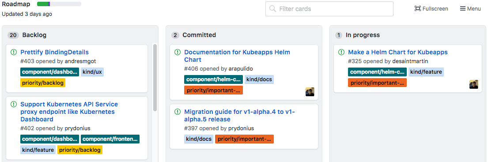
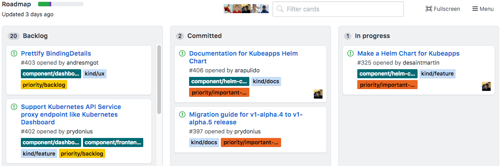

# GitHub Assignees Bookmarklet

:octocat: Bookmarklet to show issue assignees' avatars in GitHub project bar.

This allows you to quickly select/unselect a user by clicking on their avatar.

## Preview

Using [a random GitHub project](https://github.com/kubeapps/kubeapps/projects/11)

### Before

### After

## Usage

1. Create a new bookmark in your browser.
    * e.g. in Chrome: Right click on the bookmark bar > *Add page...*
2. In the URL field, copy the whole contents of [bookmarklet.min.js](./bookmarklet.min.js)
3. Any time you're on a GitHub project board page, click the bookmarklet to show the avatars in the top bar!
